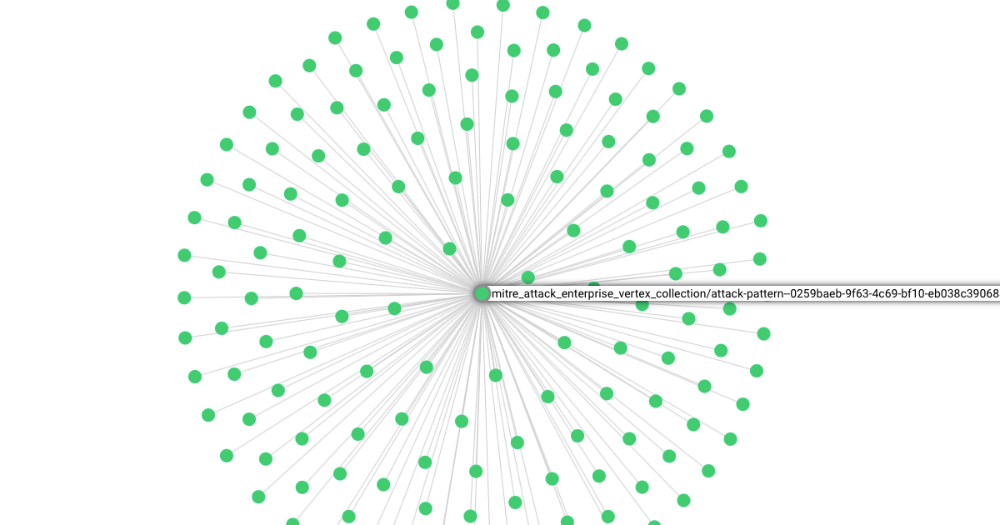

# stix2arango

[](https://codecov.io/gh/muchdogesec/stix2arango)

## Overview



stix2arango is a command line tool that takes a group of STIX 2.1 objects in a bundle and inserts them into ArangoDB. It can also handle updates to existing objects in ArangoDB imported in a bundle.

1. STIX 2.1 bundle entered
2. User chooses database/collection names (stix2arango creates as needed)
3. stix2arango inserts objects (or updates them) and then generates any relationships between them

## tl;dr

[](https://www.youtube.com/watch?v=zn6KCj2O5CY)

[Watch the demo](https://www.youtube.com/watch?v=zn6KCj2O5CY).

## Usage

### Install the script

```shell
# clone the latest code
git clone https://github.com/muchdogesec/stix2arango
# create a venv
cd stix2arango
python3 -m venv stix2arango-venv
source stix2arango-venv/bin/activate
# install requirements
pip3 install .
````

Note, the installation assumes ArangoDB is already installed locally.

[You can install ArangoDB here](https://arangodb.com/download/). stix2arango is compatible with both the Enterprise and Community versions.

#### A note for Mac users

Fellow Mac users, ArangoDB can be installed and run using homebrew as follows;

```shell
## Install
brew install arangodb
## Run
brew services start arangodb
## will now be accessible in a browser at: http://127.0.0.1:8529 . Default username is root with no password set (leave blank) 
## Stop
brew services stop arangodb
```

### Configuration options

stix2arango has various settings that are defined in an `.env` file.

To create a template for the file:

```shell
cp .env.example .env
```

To see more information about how to set the variables, and what they do, read the `.env.markdown` file.

### Run

```shell
python3 stix2arango.py \
	--file PATH/TO/STIX.json \
	--database NAME \
	--collection NAME \
	--stix2arango_note SOMETHING \
	--ignore_embedded_relationships BOOLEAN
```

Where;

* `--file` (required): is the path to the valid STIX 2.1 bundle .json file
* `--database` (required): is the name of the Arango database the objects should be stored in. If database does not exist, stix2arango will create it
* `--collection` (required): is the name of the Arango collection in the database specified the objects should be stored in. If the collection does not exist, stix2arango will create it
* `--stix2arango_note` (optional): Will be stored under the `_stix2arango_note` custom attribute in ArangoDB. Useful as can be used in AQL. `a-z` characters only. Max 24 chars.
* `--ignore_embedded_relationships` (optional, boolean):  if `true` passed, this will stop ANY embedded relationships from being generated. This applies for all object types (SDO, SCO, SRO, SMO). If you want to target certain object types see `ignore_embedded_relationships_sro` and `ignore_embedded_relationships_sro` flags. ` Default is `false`
* `--ignore_embedded_relationships_sro` (optional, boolean): if `true` passed, will stop any embedded relationships from being generated from SRO objects (`type` = `relationship`). Default is `false`
* `--ignore_embedded_relationships_smo` (optional, boolean): if `true` passed, will stop any embedded relationships from being generated from SMO objects (`type` = `marking-definition`, `extension-definition`, `language-content`). Default is `false`
* `--is_large_file` (pass flag): Use this mode when the bundle is very large (>100mb), this will chunk the input into multiple files before loading into memory.

For example, [using the MITRE ATT&CK Enterprise bundle](https://raw.githubusercontent.com/mitre/cti/master/enterprise-attack/enterprise-attack.json);

```shell
python3 stix2arango.py \
	--file cti_knowledge_base_store/mitre-attack-enterprise/enterprise-attack-15_1.json \
	--database stix2arango_demo \
	--collection demo_1 \
	--stix2arango_note v15.1 \
	--ignore_embedded_relationships true \
	--is_large_file
```

If you want to include embedded relationships as edges in the ArangoDB collection, you would run;

```shell
python3 stix2arango.py \
	--file cti_knowledge_base_store/mitre-attack-enterprise/enterprise-attack-15_1.json \
	--database stix2arango_demo \
	--collection demo_2 \
	--stix2arango_note v15.1 \
	--ignore_embedded_relationships false \
	--is_large_file
```

#### A note on embedded relationships

stix2arango can handle all embedded references to other STIX objects under `_ref` and `_refs` properties in a STIX object when `--ignore_embedded_relationships` is set to false.

e.g.

```json
        {
            "type": "x-mitre-tactic",
            "spec_version": "2.1",
            "id": "x-mitre-tactic--b977ad29-eb0c-5f09-bb2f-6d3f23e2a175",
            "created_by_ref": "identity--8700e156-6ce9-5090-8589-f9d0aef7bdb7",
```

For the above object a STIX SRO would be generated by stix2arango with `source_ref=x-mitre-tactic--b977ad29-eb0c-5f09-bb2f-6d3f23e2a175`, `target_ref=identity--8700e156-6ce9-5090-8589-f9d0aef7bdb7` and `relationship_type=created-by`.

## Quickstart

We store a lot of STIX data from popular knowledgebases on Cloudflare R2.

This is a useful resource to quickly populate STIX data using stix2arango if you want to see what it can do.

To populate this data for yourself, check out `utilities/README.md` for import scripts.

## Useful supporting tools

* To generate STIX 2.1 Objects: [stix2 Python Lib](https://stix2.readthedocs.io/en/latest/)
* The STIX 2.1 specification: [STIX 2.1 docs](https://docs.oasis-open.org/cti/stix/v2.1/stix-v2.1.html)
* [ArangoDB docs](https://docs.arangodb.com/3.11/about-arangodb/)

## Support

[Minimal support provided via the DOGESEC community](https://community.dogesec.com/).

## License

[Apache 2.0](/LICENSE).